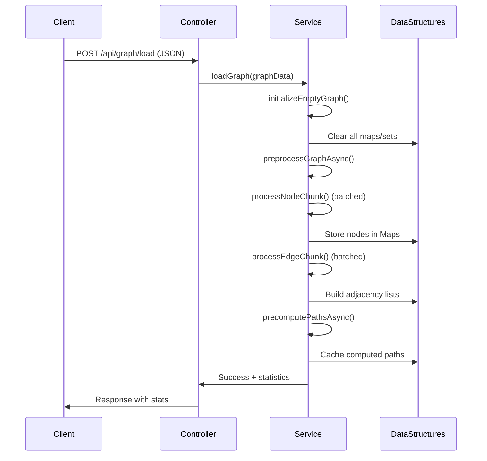
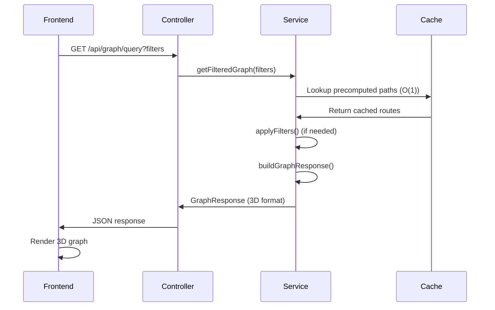

# GraphOrama Architecture & Flow Analysis

## 🎯 Project Overview

GraphOrama is a microservices graph visualization platform that analyzes security paths between services. It provides a high-performance backend API with a React-based 3D visualization frontend for exploring microservice dependencies, vulnerabilities, and attack paths.

## 📋 Assignment Context

Based on the provided assignment instructions, this system implements:

1. **RESTful API** for querying microservices graph data
2. **Graph Structure** that can be rendered in client-side applications
3. **Train Ticket Microservices** analysis (from the provided JSON data)
4. **Attack Path Analysis** focusing on public-exposed to sink connections

## 🏗️ System Architecture

### Backend Architecture (NestJS)

```
┌─────────────────────────────────────────────────┐
│                 NestJS Backend                   │
├─────────────────────────────────────────────────┤
│  ┌─────────────────┐    ┌─────────────────────┐  │
│  │ GraphController │───▶│   GraphService      │  │
│  │                 │    │                     │  │
│  │ • POST /load    │    │ • O(1) Lookups     │  │
│  │ • POST /upload  │    │ • Pre-computed      │  │
│  │ • GET /query    │    │   Paths             │  │
│  │ • GET /stats    │    │ • Non-blocking      │  │
│  └─────────────────┘    │   Operations        │  │
│                         └─────────────────────┘  │
├─────────────────────────────────────────────────┤
│               Data Structures                    │
│  ┌─────────────┐ ┌─────────────┐ ┌─────────────┐ │
│  │ Nodes Map   │ │ Adjacency   │ │ Path Cache  │ │
│  │ (O(1))      │ │ Lists       │ │ (O(1))      │ │
│  └─────────────┘ └─────────────┘ └─────────────┘ │
└─────────────────────────────────────────────────┘
```

### Frontend Architecture (React + TypeScript)

```
┌─────────────────────────────────────────────────┐
│                React Frontend                    │
├─────────────────────────────────────────────────┤
│  ┌─────────────┐    ┌─────────────────────────┐  │
│  │    App      │───▶│     GraphViewer         │  │
│  │ Component   │    │                         │  │
│  └─────────────┘    │ • 3D Force Graph        │  │
│         │            │ • Real-time Updates     │  │
│  ┌─────────────┐    │ • Interactive Controls │  │
│  │   Controls  │    └─────────────────────────┘  │
│  │             │                                 │
│  │ • Filters   │                                 │
│  │ • Upload    │                                 │
│  │ • Config    │                                 │
│  └─────────────┘                                 │
└─────────────────────────────────────────────────┘
```

## 🔄 Data Flow Analysis

### 1. Data Loading Flow



### 2. Query Processing Flow



### 3. Real-time Filtering Flow

```
User Interaction → Filter State Change → API Call → Cached Lookup → 3D Re-render
     ↓                    ↓                 ↓           ↓            ↓
Filter Button → React setState → HTTP Request → O(1) Map → Force Graph Update
```

## 📊 Data Structure Design

### Core Data Models

#### Input Format (Base JSON)
```typescript
interface ServiceNode {
    name: string;
    kind: string;           // "service", "rds", "sqs"
    language?: string;      // "java", etc.
    path?: string;         // file path
    publicExposed?: boolean;
    vulnerabilities?: Vulnerability[];
}

interface Edge {
    from: string;
    to: string | string[];
}
```

#### Internal Optimized Storage
```typescript
class GraphService {
    // O(1) lookups
    private nodes: Map<string, ServiceNode> = new Map();
    private adjacencyList: Map<string, Set<string>> = new Map();
    private reverseAdjacencyList: Map<string, Set<string>> = new Map();
    
    // O(1) filtered collections
    private publicNodes: Set<string> = new Set();
    private sinkNodes: Set<string> = new Set();
    private vulnerableNodes: Set<string> = new Set();
    
    // O(1) path lookups
    private publicPaths: Map<string, Route[]> = new Map();
    private sinkPaths: Map<string, Route[]> = new Map();
    private vulnerablePaths: Map<string, Route[]> = new Map();
}
```

#### Output Format (3D Graph Compatible)
```typescript
interface GraphResponse {
    nodes: GraphNode[];     // id, name, group, flags
    links: GraphLink[];     // source, target, value
    metadata: {
        totalNodes: number;
        totalEdges: number;
        publicNodes: number;
        sinkNodes: number;
        vulnerableNodes: number;
    };
}
```

## ⚡ Performance Optimizations

### 1. O(1) Lookup Strategy
- **Maps over Objects**: True O(1) performance for node access
- **Set-based Collections**: O(1) membership testing
- **Pre-computed Indexes**: Separate sets for public/sink/vulnerable nodes

### 2. Non-blocking Operations
```typescript
// Event loop yielding
private yieldToEventLoop(): Promise<void> {
    return new Promise(resolve => setImmediate(resolve));
}

// Chunked processing
private async processNodeChunk(nodes: ServiceNode[]): Promise<void> {
    nodes.forEach(node => {
        // Process node
    });
    await this.yieldToEventLoop(); // Prevent blocking
}
```

### 3. Path Pre-computation
- **Load Time**: Compute all possible paths during data loading
- **Query Time**: O(1) lookup from pre-computed cache
- **Memory Trade-off**: Higher memory usage for faster queries

### 4. Recursive Path Finding (No While Loops)
```typescript
private async explorePathsRecursive(
    currentNode: string,
    currentPath: string[],
    visited: Set<string>,
    routes: Route[],
    direction: 'forward' | 'backward',
    depth: number,
    maxDepth: number
): Promise<void> {
    // Recursive exploration without blocking while loops
}
```

## 🔍 Filtering Capabilities

### Built-in Filters

1. **startsWithPublic**: Paths from publicly exposed services
2. **endsInSink**: Paths ending in data stores (RDS, SQS)
3. **hasVulnerability**: Paths passing through vulnerable services

### Filter Composition
```typescript
// Filters can be combined
GET /api/graph/query?startsWithPublic=true&endsInSink=true&hasVulnerability=true
```

### Custom Filters
```typescript
POST /api/graph/query/custom
{
    "customFilters": [
        "route => route.path.length > 3",
        "route => route.path.includes('auth-service')"
    ]
}
```

## 🎨 Frontend Integration

### 3D Force Graph Integration
```typescript
// GraphViewer component
const GraphViewer = ({ apiUrl, filter }) => {
    const [graphData, setGraphData] = useState(null);
    
    useEffect(() => {
        fetch(`${apiUrl}?${filter}=true`)
            .then(res => res.json())
            .then(data => setGraphData(data));
    }, [apiUrl, filter]);
    
    return (
        <ForceGraph3D
            graphData={graphData}
            nodeLabel="name"
            nodeColor={node => getNodeColor(node)}
            linkDirectionalParticles={2}
        />
    );
};
```

### Real-time Updates
- **Filter Changes**: Instant re-query and re-render
- **File Upload**: Automatic graph reload
- **Interactive Controls**: Dynamic filter combinations

## 🔒 Security Analysis Features

### Attack Path Detection
1. **Public to Sink Paths**: Find routes from exposed services to data stores
2. **Vulnerability Paths**: Trace paths through compromised services
3. **Multi-hop Analysis**: Complex attack chains with multiple services

### Vulnerability Mapping
- **Severity Levels**: High, Medium, Low vulnerability classification
- **CWE Integration**: Common Weakness Enumeration mapping
- **Path Risk Assessment**: Risk scoring based on path composition

## 📈 Scalability Considerations

### Memory Management
- **Chunked Processing**: Large datasets processed in batches
- **Lazy Evaluation**: Compute only what's needed
- **Garbage Collection**: Proper cleanup of temporary objects

### Query Performance
- **Cache Strategy**: Pre-computed paths eliminate runtime traversal
- **Index Strategy**: Multiple indexes for different query patterns
- **Batch Operations**: Group operations to reduce overhead

### Network Optimization
- **Response Compression**: Gzip compression enabled
- **Efficient Serialization**: Minimal JSON payload structure
- **Connection Pooling**: HTTP/2 support for multiple requests

## 🚀 API Endpoints Overview

### Core Endpoints

| Method | Endpoint | Purpose | Performance |
|--------|----------|---------|-------------|
| POST | `/api/graph/load` | Load graph data | O(n + e) initial, then O(1) |
| POST | `/api/graph/upload` | File upload | Same as load |
| GET | `/api/graph/query` | Filter query | O(1) lookup |
| POST | `/api/graph/query/custom` | Custom filters | O(1) + filter time |
| GET | `/api/graph/statistics` | Graph stats | O(1) |

### Response Formats

All responses optimized for 3D Force Graph consumption:
```json
{
  "nodes": [{"id": "service-name", "group": "service", "isPublic": true}],
  "links": [{"source": "from", "target": "to", "value": 1}],
  "metadata": {"totalNodes": 42, "vulnerableNodes": 2}
}
```

## 🎯 Alignment with Assignment Requirements

### ✅ RESTful API Implementation
- **Clean REST Design**: Resource-based URLs, proper HTTP methods
- **JSON Communication**: Standard request/response format
- **Error Handling**: Proper HTTP status codes and error messages

### ✅ Graph Structure Rendering
- **3D Force Graph Ready**: Direct compatibility with visualization libraries
- **Node/Link Format**: Standard graph data structure
- **Interactive Features**: Real-time filtering and exploration

### ✅ Query Engine Features
- **High Performance**: O(1) lookups for production readiness
- **Flexible Filtering**: Multiple filter types and combinations
- **Extensibility**: Custom filter support for advanced queries

## 🔮 Future Enhancements

1. **Real-time Updates**: WebSocket support for live graph changes
2. **Advanced Analytics**: Graph metrics and centrality analysis
3. **Export Features**: PDF/PNG export of visualizations
4. **Authentication**: User management and access control
5. **Caching Layer**: Redis integration for distributed deployments

## 📚 Technology Stack Summary

| Layer | Technology | Purpose |
|-------|------------|---------|
| Backend API | NestJS + TypeScript | High-performance REST API |
| Frontend | React + TypeScript | Interactive 3D visualization |
| 3D Graphics | react-force-graph-3d | WebGL-based graph rendering |
| Build Tools | Vite, esbuild | Fast development and builds |
| Testing | Vitest, Jest | Unit and integration tests |
| Documentation | Swagger/OpenAPI | API documentation |

This architecture provides a production-ready, scalable solution for microservices graph analysis with excellent performance characteristics and user experience.
